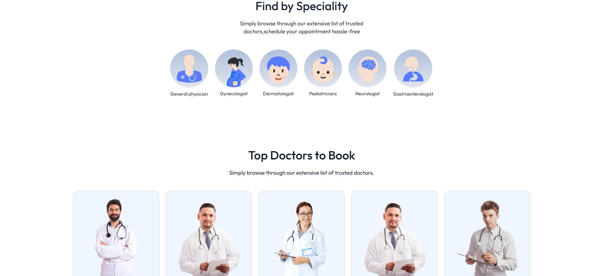
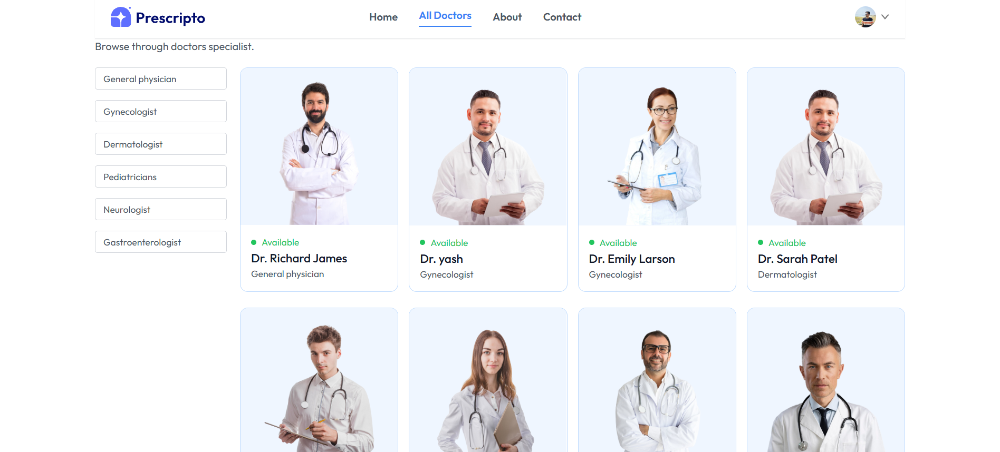
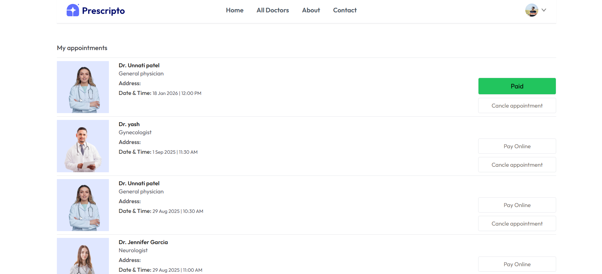
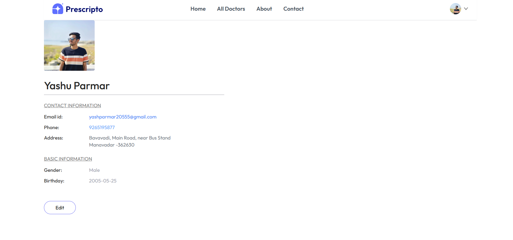
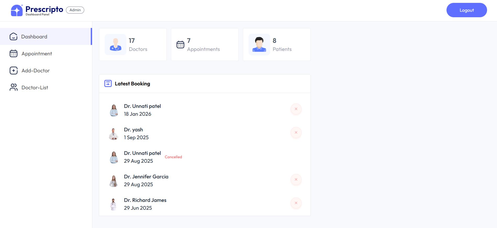
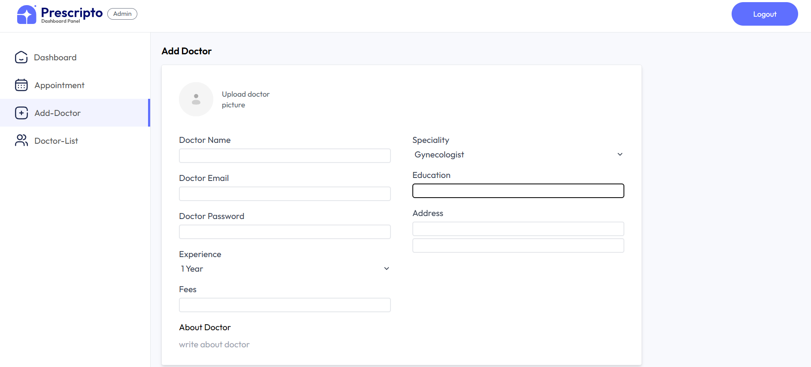

🏥 Doctor Appointment Booking System (MERN)

A full-stack MERN application that allows patients to book doctor appointments easily with a dedicated Admin Panel for management.

📁 Project Structure
doctor-appointment/
│
├── admin/        # Admin Dashboard
├── backend/      # Node.js + Express API
├── frontend/     # React User Interface
│
├── docker-compose.yml
├── .gitignore
└── README.md

🚀 Features
👨‍⚕️ User

Register & Login

View doctors

Book appointments

Appointment history

🛠 Admin

Secure admin login

Manage doctors

View all appointments

Update appointment status

🧰 Tech Stack
Layer	Technology
Frontend	React, Tailwind CSS
Backend	Node.js, Express.js
Database	MongoDB
Auth	JWT
DevOps	Docker, Docker Compose
⚙️ Environment Setup

Create .env file in root:

MONGODB_URI=
CLOUDINARY_NAME =
CLOUDINARY_API_KEY = 
CLOUDINARY_SECRET_KEY = 
ADMIN_EMAIL = 
ADMIN_PASSWORD = 
JWT_SECRET=
RAZORPAY_KEY_ID=
RAZORPAY_KEY_SECRET=

🐳 Run Using Docker
docker compose up --build

Access:

Frontend → http://localhost:5173

Backend → http://localhost:4000

Admin → http://localhost:5174

▶ Run Manually
Backend
cd backend
npm install
npm start

Frontend
cd frontend
npm install
npm run dev

Admin
cd admin
npm install
npm run dev

📸 Screenshots
User Panel 

Admin Panel

🔐 Security

JWT Authentication

Protected Routes

Environment Variables

📦 Future Enhancements

Email notifications

Video consultation

Doctor rating system

👨‍💻 Author

Yash Parmar
DevOps & MERN Developer

⭐ Support

If you like this project
👉 Give it a ⭐ on GitHub!